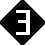
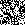
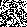
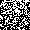
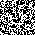
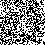
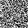

___
# Информация
Данный код написан в рамках курсовой работы за второй семестр СПБгУ (Прикладная математика, информатика и искусственный интеллект) по теме "Реализация и визуализация некоторых методов численной оптимизации".

В работе были рассмотрены [метод имитации отжига](https://ru.wikipedia.org/wiki/%D0%90%D0%BB%D0%B3%D0%BE%D1%80%D0%B8%D1%82%D0%BC_%D0%B8%D0%BC%D0%B8%D1%82%D0%B0%D1%86%D0%B8%D0%B8_%D0%BE%D1%82%D0%B6%D0%B8%D0%B3%D0%B0) (задача коммивояжёра) и [генетический алгоритм](https://ru.wikipedia.org/wiki/%D0%93%D0%B5%D0%BD%D0%B5%D1%82%D0%B8%D1%87%D0%B5%D1%81%D0%BA%D0%B8%D0%B9_%D0%B0%D0%BB%D0%B3%D0%BE%D1%80%D0%B8%D1%82%D0%BC) (чёрно-белые нонограммы).
___
# Работа генетического алгоритма

___
# Работа метода имитации отжига

